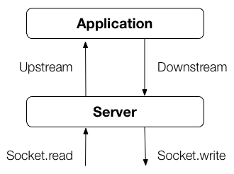

# Getting Started with Momentum

## Introduction

Writing performant network applications is not easy task. (Describe the
problem...)

Momentum is an attempt to improve the state of the art in terms of both
performance and ease of use. (Say more...)

## About this guide

This guide is a quick tutoria to help you get started writing network
applications with Momentum. It should take no more than 20 minutes to
go through.

This guide is written for Momentum 0.3.0.

## Prerequisites

Before continuing, make sure that you have the following:

* About 20 minutes of free time.
* A working [clojure](http://www.clojure.org/) environment with
  [leiningen](https://github.com/technomancy/leiningen). On OS X, this
  can easily be done with [Homebrew](https://github.com/mxcl/homebrew) by
  running `brew install leiningen`.

## A simple echo server

The first application that we will be writing is a very simple TCP echo
server. Every message that the client sends the server will be echoed
back to the client. Let's get started.

### Setup

First, generate a new leiningen project:

    $ lein new echo
    Created new project in: /Users/carllerche/Code/echo
    Look over project.clj and start coding in echo/core.clj

Next, open project.clj and the momentum dependency.

```clojure
(defproject echo "1.0.0-SNAPSHOT"
  :description "FIXME: write description"
  :dependencies [[org.clojure/clojure "1.3.0"]
                 [io.tilde.momentum/momentum "0.3.0"]])
```

Install momentum by running: `lein deps`. Everything should be ready
good to go.

### Code

Open `src/echo/core.clj` and add the following code. Don't worry, all
the specifics will be explained shortly.

```clojure
(ns echo.core
  (:require
   [momentum.net.server :as server])
  (:gen-class))

(defn -main
  [& args]
  (server/start
   (fn [downstream env]
     (fn [event value]
       (when (= event :message)
         (downstream :message value)))))

  (println "Running echo server..."))
```

Now, start the server by running: `lein run -m echo.core`. Once "Running
echo server..." is displayed in the terminal, the server is running on
port 4040. Let's try it out with good ol' telnet.

```
$ telnet localhost 4040
Trying ::1...
Connected to localhost.
Escape character is '^]'.
Hello
Hello
ZOMG
ZOMG
Stop it!
Stop it!
^]
telnet> quit
Connection closed.
```

As expected, everything that I type, the server echos back. The telnet
session is exited by first pressing the escale character (in this case
CTRL-]), then by typing in `quit`.

Let's go back to the code we wrote and break it down.

```clojure
(ns echo.core
  (:require
   [momentum.net.server :as server])
  (:gen-class))
```

The first thing that we did was to require the momentum.net.server
namespace, which contains the start function that we use. All functions
related to dealing with raw network servers (TCP and UDP) are in this
namespace.

Next, we start the server by invoking `server/start` and passing the
application as the argument.

### The application

A momentum application consists of three things. A bind function, an
upstream function, and a downstream function.

The bind function is invoked by the server once per "session." A session
can mean different things in different situations. In the case of the
raw TCP server, a session is one TCP connection. In the case of an HTTP
server, a session might be one HTTP exchange (a single request and
response pair).

Bind functions have two arguments. The first argument is the downstream
function for that session. The second is the environment map for that
session. The environment map is mostly just a way to pass arbitrary data
around from the server, through middleware (which will be introduced
later), up to the application.

Bind functions must return the upstream function for that session.

Both the upstream and the downstream functions have two arguments. The
first is an event type, the second is an event value. These functions
are how events get passed around. The downstream function is used by the
application to send events, such as messages to write to the socket,
downstream (towards the server). The upstream function is used by the
server to send events, up to the application.



So, back to the code...

```clojure
(server/start
 (fn [downstream env] ;; Bind function
   (fn [event value]  ;; Upstream function
     (when (= event :message)
       (downstream :message value)))))
```

When a connection is opened with the server, momentum will invoke the
bind function, passing in a downstream function that, when invoked, will
write messages directly back to the client. Whenever a message is
received from the client, momentum will dispatch that event using the
upstream function. Our application will get the event and echo it back
to the client.

Note: It is not legal to invoke the downstream function until the
upstream function receives an event.

### Event lifecycle

The lifecycle begins with an :open event sent upstream. It is not legal
to invoke the downstream function until the application receives an
event.

The events that can be sent upstream.

* `:open` - The connection is opened. The value is a map with some
  information regarding the socket.
* `:close` - The connection is closed. The value is nil.
* `:message`- A message is received. The value is a buffer representing
  the message.
* `:pause` - The socket's write buffer is full, the application should
  stop sending :message events. The value is nil.
* `:resume` - The socket's write buffer is drained, the application may
  resume sending :message events. The value is nil.
* `:abort` - Something went wrong. The value is the exception that
  caused the event.

The events that can be sent downstream.

* `:close` - The socket should be closed.
* `:message` - A message to send to the client. The value is a buffer
  representing the message.
* `:pause` - The application is overloaded, the server should stop
  sending :message events. The value is nil.
* `:resume` - The application is ready to receive further :message
  events. The value is nil.
* `:abort` - Something went wrong, the connection should be terminated.
  The value is the exception that caused the event.

